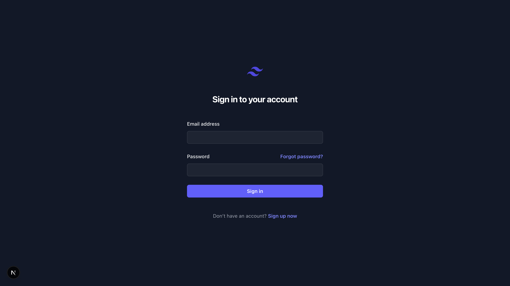
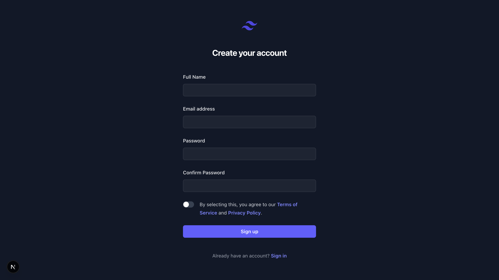
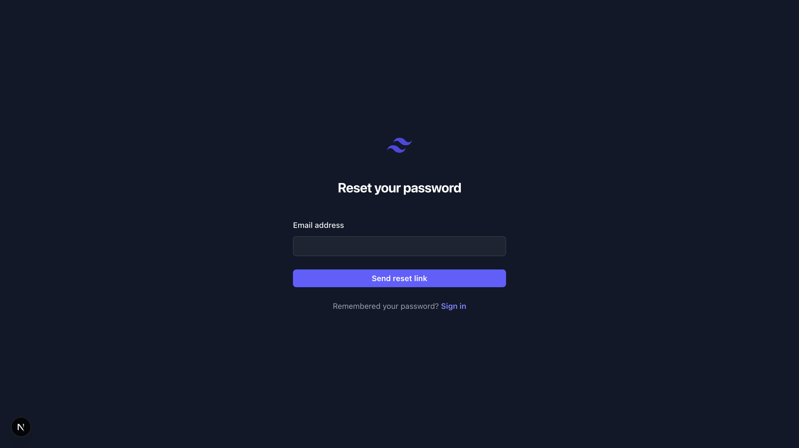
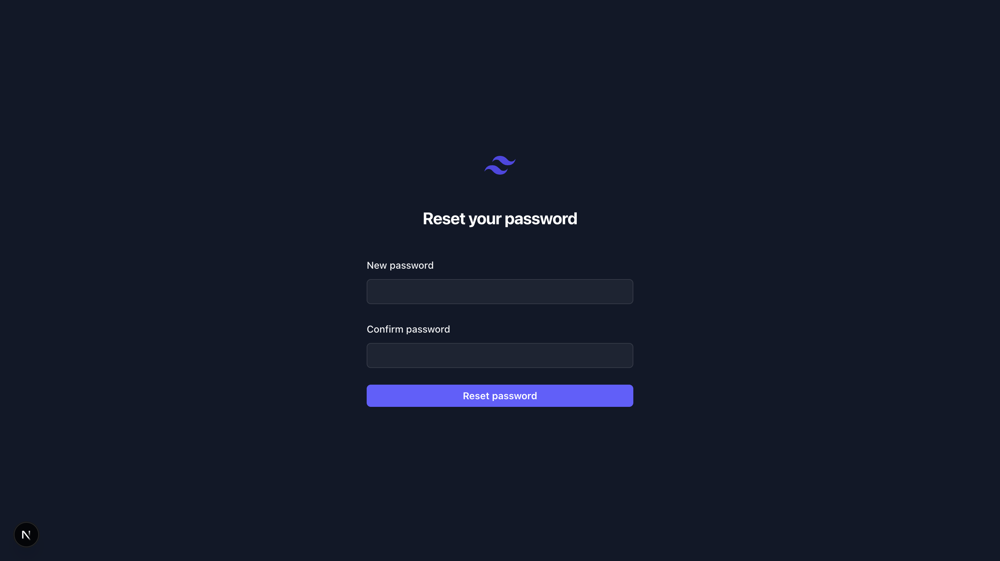
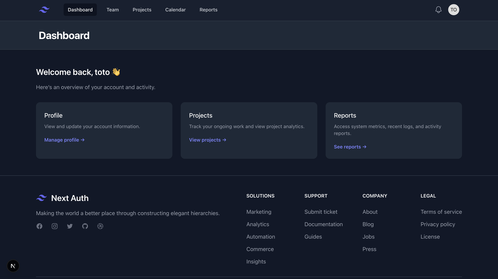

# 🚀 Next Auth Boilerplate

This is a modern **Next.js** boilerplate designed to help you kickstart secure authentication in your Next.js projects. It features built-in support for **dark mode**, **TailwindCSS**, a clean modular architecture, and **a real-world database integration**.

---

## 💎 Key Features & Tech Stack

* ⚡️ **Next.js 15+** with App Router

  * **Credentials Provider** (Email/Password)
* 💾 **Prisma ORM** for database abstraction
* 🐘 **PostgreSQL (via Prisma Accelerate)** for persistence
* ✉️ **Email System** (Forgot & Reset Password) using Nodemailer
* 🎨 **TailwindCSS** with light/dark theme
* 🤩 Modular UI Components (`Navbar`, `Header`, `Main`, `Input`, etc.)
* 🤯 Protected routes and session-based navigation
* ✅ **Server Actions** for form handling (register, login, forgot/reset password, verification)
* 🔍 **Form validation** using Zod

---

## Demo Pages

| Login page                     | Register page                        | Forgot password                 |
|--------------------------------|--------------------------------------|---------------------------------|
|  |  |  |

| Reset password                 | 404 not found                         | Dashboard                              |
|--------------------------------|---------------------------------------|----------------------------------------|
|  |       |  |

---

## 🛠️ Getting Started

First, clone the repository and install dependencies:

```bash
git clone https://github.com/michel-ciardullo/next-auth-boilerplate.git
cd next-auth-boilerplate
npm install
```

### 1. Database Setup (Prisma)

Before running the app, apply the database schema:

```bash
npx prisma migrate dev --name init
npx prisma db seed
```

> ✅ The schema includes `User` and `PasswordReset` models to support authentication and password recovery flows.

### 2. Start the Development Server

```bash
npm run dev
# or
yarn dev
# or
pnpm dev
```

Open [http://localhost:3000](http://localhost:3000) with your browser to see the app.

---

## ⚙️ Environment Setup

Create a `.env` file in the project root and configure the following variables:

```env
DATABASE_URL=""

NEXTAUTH_URL="http://localhost:3000"
NEXTAUTH_SECRET="your-secret-key="

# Email setup for password recovery
EMAIL_HOST=smtp.example.com
EMAIL_PORT=587
EMAIL_USER=your-email@example.com
EMAIL_PASS=your-email-password
EMAIL_FROM="Your App <no-reply@example.com>"
```

> 💡 You can generate a secure secret with:
>
> ```bash
> openssl rand -base64 32
> ```

---

## 🔐 Authentication Flow

This boilerplate supports **full authentication & account management**:

1. **Register** (`/auth/register`):

   * Users can create accounts.
   * Fields are validated via **Zod**.
   * Errors show inline next to each field.
   * Passwords are hashed with **bcrypt**.

2. **Login** (`/auth/login`):

   * Credentials Provider.
   * Server-side validation and session creation.

3. **Forgot Password** (`/auth/forgot`):

   * Users can request a password reset link.
   * Emails are sent via **Nodemailer**.
   * Reset tokens stored in `PasswordReset` table with expiry.

4. **Reset Password** (`/auth/reset`):

   * Validates token and expiry.
   * Allows updating the password securely.
   * Redirects to login after success.

5. **Email Verification** (`/auth/verify`):

   * Users receive a verification link on registration.
   * Server Action verifies token and activates the account.
   * Invalid/expired tokens redirect to an error page.

6. **Session Management**:

   * `useSession()` hook and `<SessionProvider>` manage global session state.
   * Navbar adapts automatically (shows login/register or user info).

---

## 📝 Form Handling & Validation

* **Server Actions** are used for all forms (`register`, `forgot/reset password`, `verify`).
* **Zod schemas** validate inputs before hitting the database.
* Inline error display for all fields.
* Preserves valid field values on validation errors.

---

## 💻 Development Notes

* Modular UI and server actions make adding new auth flows simple.
* Prisma abstracts all database interactions.
* Nodemailer setup allows real email sending in dev and production.
* TailwindCSS adapts automatically to dark/light themes.
* Protect routes via session checks (`/dashboard`).

---

## 📦 Deployment

Recommended on [**Vercel**](https://vercel.com):

1. Push your code to GitHub
2. Import the repo on [Vercel](https://vercel.com/new)
3. Set environment variables (`NEXTAUTH_URL`, `NEXTAUTH_SECRET`, email configs)
4. Deploy 🚀

Read more in the [Next.js Deployment Documentation](https://nextjs.org/docs/app/building-your-application/deploying).

---

## 🧠 Learn More

* [Next.js Documentation](https://nextjs.org/docs)
* [TailwindCSS Documentation](https://tailwindcss.com/docs)
* [Prisma Documentation](https://www.prisma.io/docs)
* [Zod Documentation](https://zod.dev)
* [Nodemailer Documentation](https://nodemailer.com)

---

## 🧑‍💻 Author

Created with ❤️ by michel-ciardullo

Feel free to contribute, fork, or open issues to improve the boilerplate!
